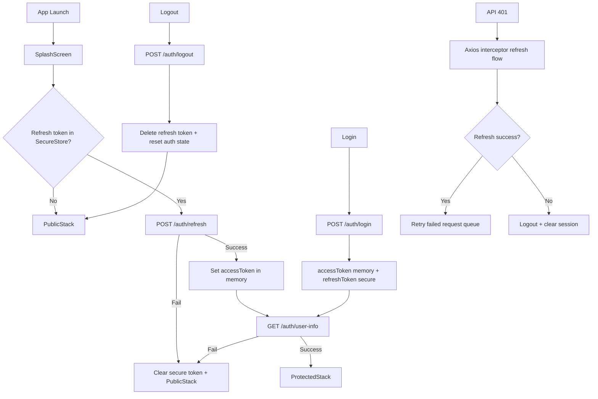

# Authentication & Session Management (Production Blueprint)

## Scalable Folder Structure

```text
src/
  modules/
    ecommerce/
      auth/
        api/
          axios.ts
        context/
          AuthContext.tsx
        screens/
          SplashScreen.tsx
          LoginScreen.tsx
          RegisterScreen.tsx
          VerifyEmailScreen.tsx
        AUTH_ARCHITECTURE.md
      navigation/
        MainTabs.tsx
  navigation/
    RootNavigator.tsx
    types.ts
```

## Session Lifecycle Diagram


