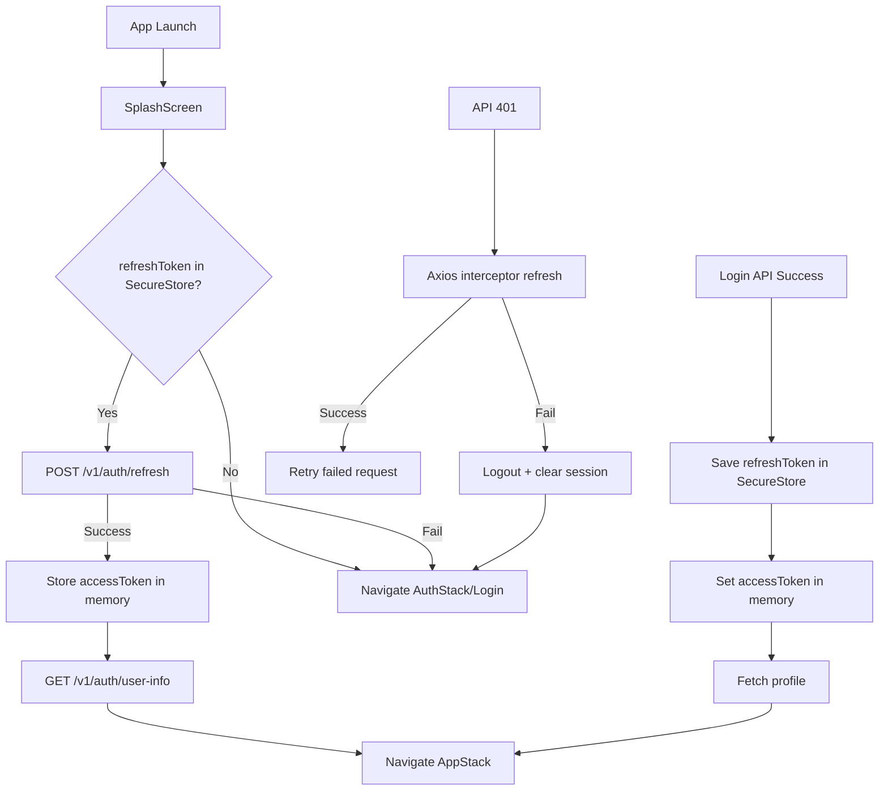

# Authentication & Session Management Architecture

## Final Navigation Shape

```text
RootNavigator
├── SplashScreen (session checking)
├── AuthStack
│   ├── Login
│   ├── Register
│   └── VerifyEmail
└── AppStack (all commerce screens, protected)
    ├── Home
    ├── ProductDetails
    ├── Cart
    ├── Checkout
    ├── Profile
    ├── Orders
    ├── ServiceStack
    └── RewardStack
```

## Session Lifecycle



## State Rules

- In memory only:
  - `user`
  - `accessToken`
  - `isAuthenticated`
- Secure storage only:
  - `refreshToken`
- No guest cart local storage in auth context.
- Cart/checkout stay backend-auth based via `user_id`.
